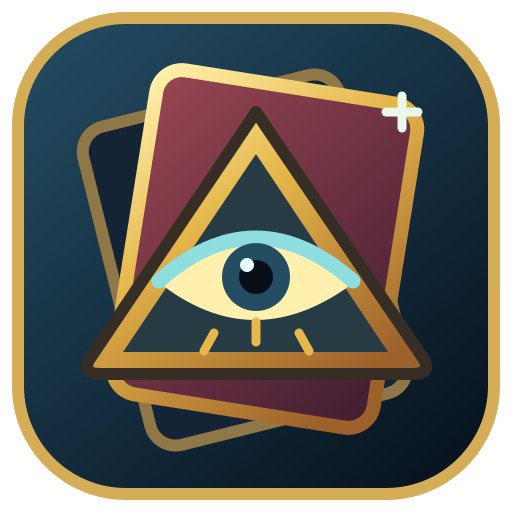

# YFM Fusion Companion

A native Windows companion for **Yu-Gi-Oh! Forbidden Memories**: legal fusion routes, live duel advice, exact deck analysis, and an optimizer that works with the cards you own. Offline, English-only, and open-source. Game memory and save files are read-only.

**[Download the latest Windows release](https://github.com/vincevandriel/yfm-fusion-companion/releases/latest)** · [User guide](docs/USER_GUIDE.md) · [Design and code guide](docs/DESIGN.md) · [Contribute](CONTRIBUTING.md)

## Start playing

1. Download the **Windows-x64.zip** release asset and extract the whole folder.
2. Double-click **YFM Fusion Companion.exe**. Windows 10/11 x64 is required; .NET is included.
3. Keep **Resources**, **Documentation**, and **Licenses** beside the executable. The illustrated manual and offline HTML guides are in Documentation.

Manual tools work without an emulator. Live mode supports the validated NTSC-U game through RetroArch/SwanStation; follow [setup](docs/SETUP.md) to enable its read-only network connection. GitHub's automatic source archives are for developers, not the runnable application. Releases are unsigned; verify the published SHA-256 before trusting a download.

## What it does

- **Turn Adviser:** ordered, multi-step fusions with legal terminal equips and field interactions.
- **Live Duel:** validated game state and a compact 272 × 1002 logical-pixel companion, two-line names, and 20px guardian symbols.
- **Deck Analyzer:** all **658,008** physical opening hands of a 40-card deck, with cancellation and bounded parallel analysis.
- **Owned-Card Optimizer:** fusion consistency, compatible power-ups, removal, campaign context, and recoverable proof searches. Auto uses up to **4 search / 8 analysis workers**, bounded for the CPU.
- **Recommended Decks:** six researched reference builds with owned copies out of 40, missing cards, progression advice, and exact setup checks.
- **Built-in collection:** all 722 card images work offline. Suggested cards default to Alphabetical; card number, ATK, and DEF are also available.

Exact hand metrics describe the selected deck under modeled rules. They are not duel win rates. Timed search is best-found; optimality requires an exhausted proof within its frozen search space. See [limitations](docs/LIMITATIONS.md) and [research](docs/research/FAN_DECK_RESEARCH.md).

## Understand or change the code

The [32-section design guide](docs/DESIGN.md) explains architecture, data formats, algorithms, worker state, saves/live reads, WPF screens, testing, packaging, and extension points. Its [source index](docs/reference/SOURCE_INDEX.md) links to production files, declarations, named controls, tests, and tools.

| Location | Contents |
|---|---|
| `src/` | Data, Engine, RetroArch, and Desktop projects |
| `tests/` | Correctness and regression tests |
| `tools/` | Reproducible data, audits, documentation, benchmarks, and one release publisher |
| `assets/` | Original application icon and separately attributed card artwork |
| `docs/` | User/design guides, research, benchmarks, audit records, and historical checkpoints |
| `database-source/`, `artifacts/yfm.db` | Source facts and reproducible offline SQLite catalog |

See [CONTRIBUTING.md](CONTRIBUTING.md) for exact build, test, documentation, and release commands. [Current checkpoint](CHECKPOINT.md) and [release notes](RELEASE_NOTES.md) record the current state. Older release binaries are retired after a verified replacement; Git history and concise audit records remain available.

## License and attribution

Original code and the application icon are [MIT licensed](LICENSE). Bundled card images, game names, and related properties have separate rights and [third-party notices](THIRD_PARTY_NOTICES.md). No ROM, BIOS, emulator, or personal save is included. This independent fan utility is not affiliated with Konami, Sony, RetroArch, Libretro, or SwanStation.
